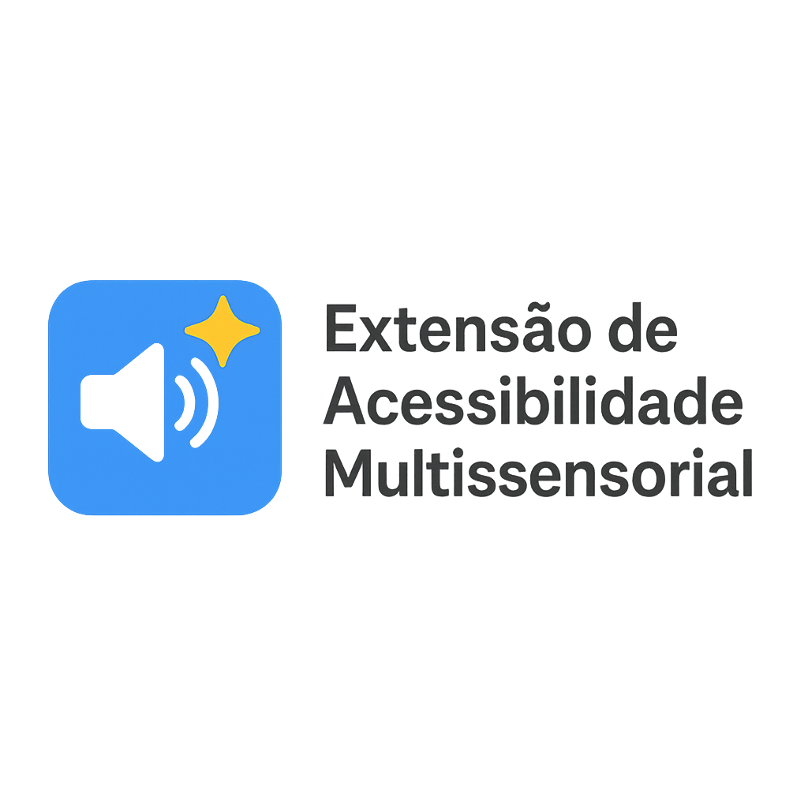

<div align="center">
  
  <h1>Extensão de Acessibilidade Multissensorial</h1>
  
  [](LICENSE)
  [](https://www.google.com/chrome/)
  [](https://platform.openai.com/api-keys)
</div>

<p align="center">
  Uma extensão Chrome que torna a web mais acessível através de explicações inteligentes, leitura em voz alta e ajustes visuais para pessoas com deficiência visual ou dificuldades de leitura.
</p>

<div align="center">
  
  [📥 Instalação](#-instalação) • 
  [✨ Funcionalidades](#-funcionalidades) • 
  [📖 Como Usar](#-como-usar) • 
  [🔧 Configurações](#-configurações-técnicas) • 
  [🤝 Contribua](#-contribuindo)
  
</div>

---

## ✨ Funcionalidades

<table>
  <tr>
    <td width="50%">
      <h3>🎯 Recursos Principais</h3>
      <ul>
        <li><b>Explicação Inteligente</b>: Selecione qualquer texto e receba uma explicação clara via GPT-4o mini</li>
        <li><b>Leitura em Voz Alta</b>: Síntese de voz natural com controles avançados</li>
        <li><b>Ajuste de Fonte</b>: Aumente ou diminua o tamanho do texto dinamicamente</li>
        <li><b>Interface Acessível</b>: Navegação por teclado e suporte a leitores de tela</li>
      </ul>
    </td>
    <td width="50%">
      <h3>🎮 Atalhos de Teclado</h3>
      <ul>
        <li><kbd>Ctrl</kbd> + <kbd>Alt</kbd> + <kbd>E</kbd> : Explicar texto selecionado</li>
        <li><kbd>Ctrl</kbd> + <kbd>Alt</kbd> + <kbd>R</kbd> : Ler texto selecionado em voz alta</li>
        <li><kbd>Ctrl</kbd> + <kbd>Alt</kbd> + <kbd>S</kbd> : Parar leitura</li>
        <li><kbd>Ctrl</kbd> + <kbd>Alt</kbd> + <kbd>+</kbd> : Aumentar fonte</li>
        <li><kbd>Ctrl</kbd> + <kbd>Alt</kbd> + <kbd>-</kbd> : Diminuir fonte</li>
      </ul>
    </td>
  </tr>
</table>

### 🛠️ Configurações Avançadas
- 🗣️ Múltiplas vozes e idiomas
- ⏩ Controle de velocidade, tom e volume
- 🎨 Temas personalizáveis (claro, escuro, alto contraste)
- 🤖 Explicações e leitura automáticas

## 🚀 Instalação

### Pré-requisitos
- **Google Chrome** (versão 88 ou superior)
- **Chave da API OpenAI** - [Obter aqui](https://platform.openai.com/api-keys)

### Guia de Instalação

<details>
<summary><b>📋 Passo a passo detalhado</b></summary>

1. **Clone ou baixe este repositório**
   ```bash
   git clone https://github.com/dougdotcon/acessibilidade-multissensorial
   cd extensao-acessibilidade
   ```

2. **Abra o Chrome e acesse as extensões**
   - Digite `chrome://extensions/` na barra de endereços
   - Ou navegue: Menu → Mais ferramentas → Extensões

3. **Ative o modo desenvolvedor**
   - Clique no botão "Modo do desenvolvedor" no canto superior direito

4. **Carregue a extensão**
   - Clique em "Carregar sem compactação"
   - Selecione a pasta da extensão

5. **Configure a API OpenAI**
   - Clique no ícone da extensão
   - Acesse "Configurações Avançadas"
   - Insira sua chave da API OpenAI
   - Clique em "Testar Conexão" para verificar

</details>

## 📖 Como Usar

<table>
  <tr>
    <td width="60%">
      <h3>Uso Básico</h3>
      <ol>
        <li><b>Selecione qualquer texto</b> em uma página web</li>
        <li><b>Utilize a barra de ferramentas</b> que aparecerá:
          <ul>
            <li>📖 <b>Explicar</b>: Receba uma explicação simplificada</li>
            <li>🔊 <b>Ler</b>: Ouça o texto em voz alta</li>
            <li>⏹️ <b>Parar</b>: Interrompa a leitura</li>
            <li>🔍+ <b>Zoom+</b>: Aumente a fonte</li>
            <li>🔍- <b>Zoom-</b>: Diminua a fonte</li>
          </ul>
        </li>
      </ol>
    </td>
    <td width="40%">
      <h3>Usando o Popup</h3>
      <ol>
        <li><b>Clique no ícone da extensão</b> na barra de ferramentas</li>
        <li><b>Acesse as ações rápidas</b>:
          <ul>
            <li>Explicar página inteira</li>
            <li>Ler página inteira</li>
            <li>Ajustar fonte da página</li>
            <li>Parar leitura</li>
          </ul>
        </li>
      </ol>
    </td>
  </tr>
</table>

### 🎨 Temas e Acessibilidade

<div align="center">
<table>
  <tr>
    <td align="center"><b>Automático</b><br>Segue o tema do sistema</td>
    <td align="center"><b>Claro</b><br>Interface clara e limpa</td>
    <td align="center"><b>Escuro</b><br>Reduz o cansaço visual</td>
    <td align="center"><b>Alto Contraste</b><br>Máxima legibilidade</td>
  </tr>
</table>
</div>

## 🔧 Configurações Técnicas

<details>
<summary><b>🗣️ Configurações de Voz</b></summary>
<ul>
  <li><b>Velocidade</b>: 0.5x a 2.0x</li>
  <li><b>Tom</b>: 0.5 a 2.0</li>
  <li><b>Volume</b>: 0% a 100%</li>
  <li><b>Vozes</b>: Todas as vozes disponíveis no sistema</li>
</ul>
</details>

<details>
<summary><b>⚙️ Configurações de Comportamento</b></summary>
<ul>
  <li><b>Explicação Automática</b>: Explica automaticamente texto selecionado</li>
  <li><b>Leitura Automática</b>: Lê automaticamente texto selecionado</li>
  <li><b>Tooltip</b>: Mostra/oculta a barra de ferramentas</li>
  <li><b>Atalhos de Teclado</b>: Habilita/desabilita atalhos</li>
</ul>
</details>

<details>
<summary><b>🔬 Configurações Avançadas</b></summary>
<ul>
  <li><b>Tamanho Máximo de Texto</b>: Limite para explicações automáticas</li>
  <li><b>Idioma das Explicações</b>: pt-BR, en-US, es-ES, fr-FR</li>
  <li><b>Modo Debug</b>: Para desenvolvedores</li>
</ul>
</details>

## 🔒 Privacidade e Segurança

<table>
  <tr>
    <td>🔐</td>
    <td><b>Sua chave da API</b> é armazenada localmente no Chrome</td>
  </tr>
  <tr>
    <td>📤</td>
    <td><b>Textos selecionados</b> são enviados apenas para a API OpenAI</td>
  </tr>
  <tr>
    <td>🛡️</td>
    <td><b>Nenhum dado</b> é coletado ou armazenado pelos desenvolvedores</td>
  </tr>
  <tr>
    <td>👁️</td>
    <td><b>Código aberto</b> para transparência total</td>
  </tr>
</table>

## 🐛 Solução de Problemas

<details>
<summary><b>A extensão não funciona</b></summary>
<ol>
  <li>Verifique se a chave da API está configurada corretamente</li>
  <li>Teste a conexão nas configurações</li>
  <li>Recarregue a página atual</li>
  <li>Verifique se a página não é uma página especial do Chrome</li>
</ol>
</details>

<details>
<summary><b>A voz não funciona</b></summary>
<ol>
  <li>Verifique se o volume está ligado</li>
  <li>Teste diferentes vozes nas configurações</li>
  <li>Verifique as permissões do navegador para áudio</li>
</ol>
</details>

<details>
<summary><b>As explicações não aparecem</b></summary>
<ol>
  <li>Verifique sua conexão com a internet</li>
  <li>Teste a chave da API nas configurações</li>
  <li>Verifique se você tem créditos na conta OpenAI</li>
</ol>
</details>

## 🤝 Contribuindo

Contribuições são bem-vindas! Para contribuir:

1. Faça um fork do projeto
2. Crie uma branch para sua feature (`git checkout -b feature/AmazingFeature`)
3. Commit suas mudanças (`git commit -m 'Add some AmazingFeature'`)
4. Push para a branch (`git push origin feature/AmazingFeature`)
5. Abra um Pull Request

## 📄 Licença

Este projeto está licenciado sob a Licença MIT - veja o arquivo [LICENSE](LICENSE) para detalhes.

## 🙏 Agradecimentos

- **OpenAI** pela API GPT-4o mini
- **Comunidade de acessibilidade** pelas diretrizes e feedback
- **Desenvolvedores** que contribuíram para este projeto

## 📞 Suporte

Se você encontrar problemas ou tiver sugestões:

1. **Abra uma issue** no GitHub
2. **Descreva o problema** detalhadamente
3. **Inclua informações** sobre seu sistema e navegador

---

<div align="center">
  <p><b>Feito com ❤️ para tornar a web mais acessível para todos.</b></p>
</div>
